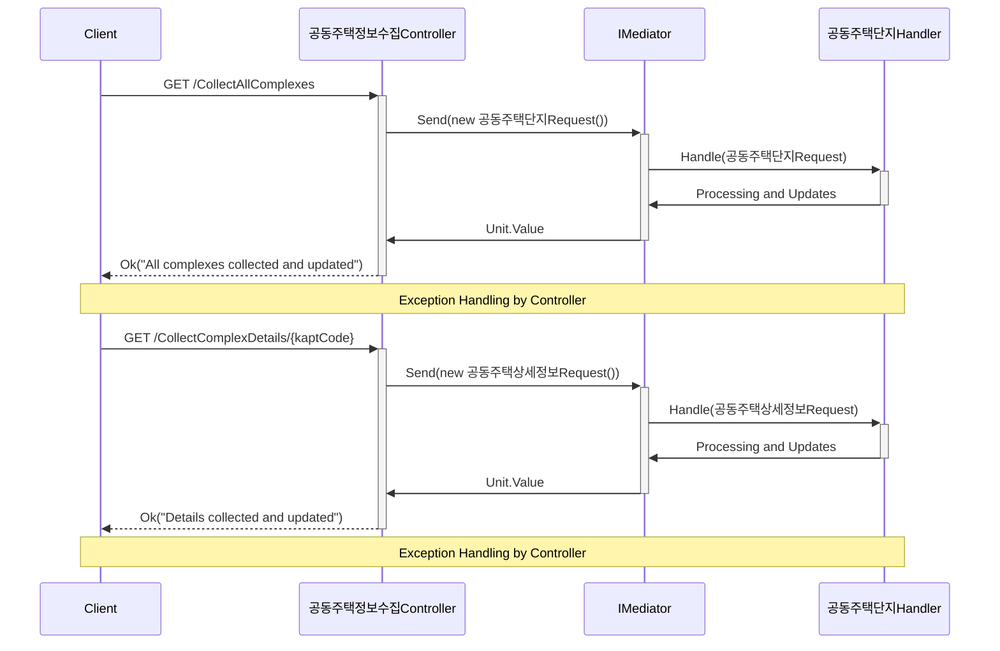
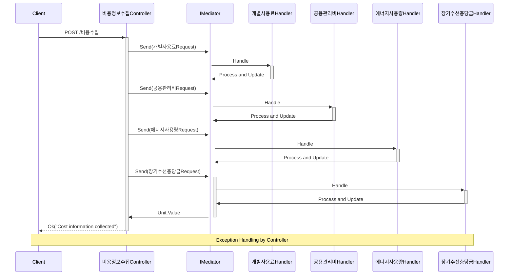

# Configuration Settings

Below you will find a basic example of the necessary `appsettings.json` configuration for this project. Please make sure to adjust the settings according to your local environment and security requirements.

## Basic Configuration

```json
{
  "Logging": {
    "LogLevel": {
      "Default": "Information",
      "Microsoft.AspNetCore": "Warning"
    }
  },
  "ConnectionStrings": {
    "공동주택": "Server=localhost\\SQLEXPRESS01;Database=공동주택Db;Trusted_Connection=True;"
  },
   "공공데이터ServiceKey": "Your Service Key"
}

```
## Asp.net Core Service Container
```ServiceContainer
builder.Services.AddHttpClient();
builder.Services.AddDbContext<공동주택DbContext>(options =>
    options.UseInMemoryDatabase("공동주택Db"));
// Registering AutoMapper
builder.Services.AddAutoMapper(
    typeof(공동주택목록MappingProfile),

    typeof(가스사용료MappingProfile),
    typeof(건물보험료MappingProfile),
    typeof(급탕비MappingProfile),
    typeof(난방비MappingProfile),
    typeof(생활폐기물수수료MappingProfile),
    typeof(선거관리위원회운영비MappingProfile),
    typeof(수도료MappingProfile),
    typeof(입주자대표회의운영비MappingProfile),
    typeof(전기료MappingProfile),
    typeof(정화조오물수수료MappingProfile),

    typeof(공동주택기본정보MappingProfile),
    typeof(공동주택상세정보MappingProfile),

    typeof(경비비MappingProfile),
    typeof(교육훈련비MappingProfile),
    typeof(기타부대비용MappingProfile),
    typeof(소독비MappingProfile),
    typeof(수선비MappingProfile),
    typeof(승강기유지비MappingProfile),
    typeof(시설유지비MappingProfile),
    typeof(안전점검비MappingProfile),
    typeof(위탁관리수수료MappingProfile),
    typeof(인건비MappingProfile),
    typeof(재해예방비MappingProfile),
    typeof(제사무비MappingProfile),
    typeof(제세공과금MappingProfile),
    typeof(지능형홈네트워크설비유지비MappingProfile),
    typeof(차량유지비MappingProfile),
    typeof(청소비MappingProfile),
    typeof(피복비MappingProfile),

    typeof(단지별적립요율MappingProfile),
    typeof(단지별충당금잔액MappingProfile),
    typeof(단지별월부과액MappingProfile),
    typeof(단지별월사용액MappingProfile)
    );

builder.Services.AddMediatR(cfg => cfg.RegisterServicesFromAssembly(Assembly.GetExecutingAssembly()));

builder.Services.AddTransient<공동주택단지목록APIService>();
builder.Services.AddTransient<공동주택단지정보APIService>();
builder.Services.AddTransient<공동주택개별관리비APIService>();
builder.Services.AddTransient<공동주택공용관리비APIService>();
builder.Services.AddTransient<공동주택에너지사용정보APIService>();
builder.Services.AddTransient<공동주택장기수선충당금APIService>();
```

<h2 align="center"><strong><span style="color:red;">공동주택정보수집Controller의 sequenceDiagram</span></strong></h2>



<h2 align="center"><strong><span style="color:red;">비용정보수집Controller의 sequenceDiagram</span></strong></h2>


