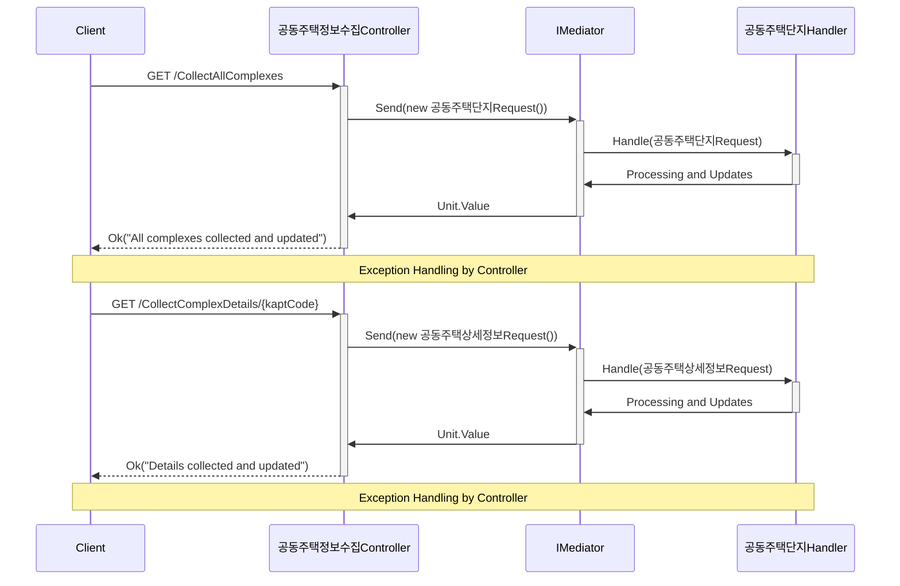
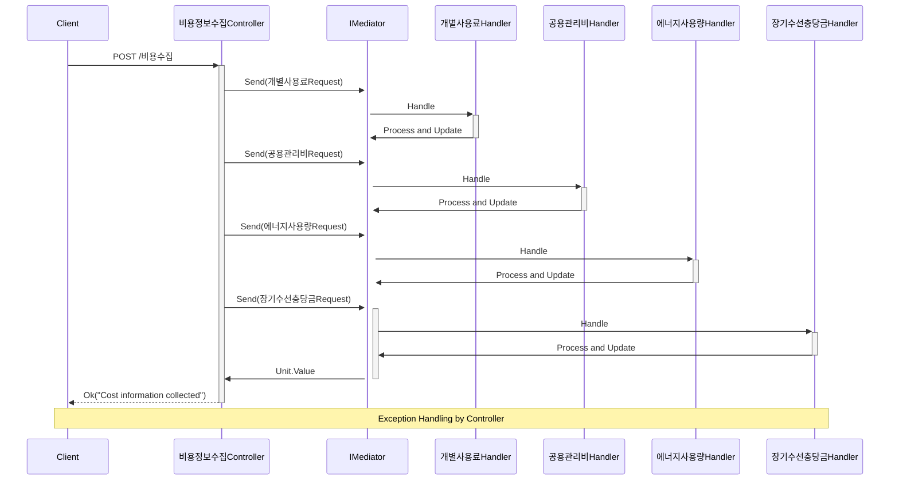

<h2 align="center"><strong>공동주택정보수집Controller의 DFD</strong></h2>

```mermaid
sequenceDiagram
    participant Client as Client
    participant Controller as 공동주택정보수집Controller
    participant Mediator as IMediator
    participant Handler as 공동주택단지Handler

    Client->>+Controller: GET /CollectAllComplexes
    Controller->>+Mediator: Send(new 공동주택단지Request())
    Mediator->>+Handler: Handle(공동주택단지Request)
    Handler->>-Mediator: Processing and Updates
    Mediator->>-Controller: Unit.Value
    Controller-->>-Client: Ok("All complexes collected and updated")
    Note over Client,Handler: Exception Handling by Controller
    
    Client->>+Controller: GET /CollectComplexDetails/{kaptCode}
    Controller->>+Mediator: Send(new 공동주택상세정보Request())
    Mediator->>+Handler: Handle(공동주택상세정보Request)
    Handler->>-Mediator: Processing and Updates
    Mediator->>-Controller: Unit.Value
    Controller-->>-Client: Ok("Details collected and updated")
    Note over Client,Handler: Exception Handling by Controller

```

<h2 align="center"><strong>비용정보수집Controller의 DFD</strong></h2>

```mermaid
sequenceDiagram
    participant Client as Client
    participant Controller as 비용정보수집Controller
    participant Mediator as IMediator
    participant 개별사용료Handler as 개별사용료Handler
    participant 공용관리비Handler as 공용관리비Handler
    participant 에너지사용량Handler as 에너지사용량Handler
    participant 장기수선충당금Handler as 장기수선충당금Handler

    Client->>+Controller: POST /비용수집
    Controller->>+Mediator: Send(개별사용료Request)
    Mediator->>+개별사용료Handler: Handle
    개별사용료Handler->>-Mediator: Process and Update
    Controller->>+Mediator: Send(공용관리비Request)
    Mediator->>+공용관리비Handler: Handle
    공용관리비Handler->>-Mediator: Process and Update
    Controller->>+Mediator: Send(에너지사용량Request)
    Mediator->>+에너지사용량Handler: Handle
    에너지사용량Handler->>-Mediator: Process and Update
    Controller->>+Mediator: Send(장기수선충당금Request)
    Mediator->>+장기수선충당금Handler: Handle
    장기수선충당금Handler->>-Mediator: Process and Update
    Mediator->>-Controller: Unit.Value
    Controller-->>-Client: Ok("Cost information collected")
    Note over Client,장기수선충당금Handler: Exception Handling by Controller

```
